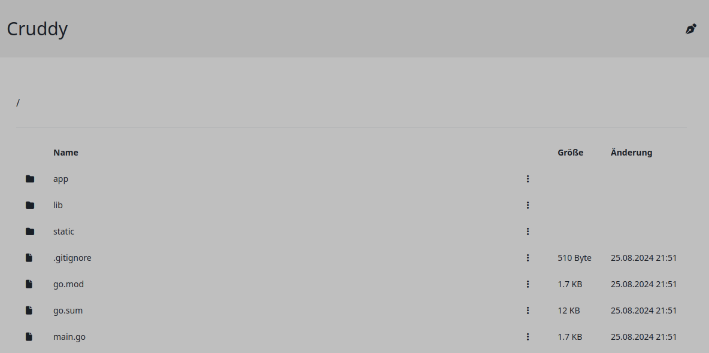

# Cruddy

Cruddy, diminutive of CRUD (create, read, update, delete), is a lightweight web file manager that allows you to create (upload), read (download), update (reupload, move), and delete files and directories. It is written in go and vue.js.

It is designed to easily presentate files and directories in a web interface, without the need of authentication or authorization.
Authentication is intentionally not part of Cruddy and must be configured upstream (e.g. in Reverse Proxy or Kubernetes Ingress).


## Features

* Create, Read, Update, Delete files and directories
* Different color schemes
* Single binary which contains the web server and the frontend


## Build

Predefined build jobs are written in the `impulsar.yml` file. You can build the project using the following command:

```bash
impulsar build
```

If you want to run the Go part with go run ., you must first build and copy the frontend using the following command:

```bash
impulsar build-frontend copy
```

Then you can run cruddy with `go run .` inside the backend directory.


## Not yet implemented

* File and directory renaming
* File and directory moving
* File and directory creation

## Screenshot


